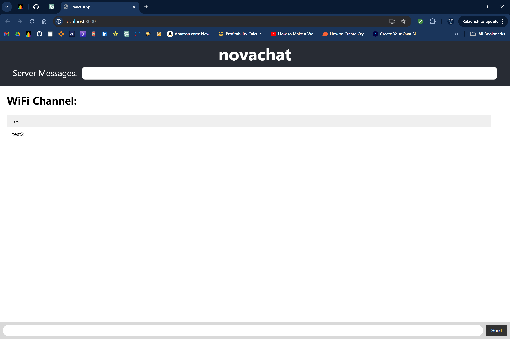

## Frontend Contributing Instructions

- 'npm start' inside of ./novachat for live development
- Edit the JSX code inside the return block of App.js.
- TODO:
  - Method to change channels
    - Priority: Left panel that shows all available rooms/channels to jumps to.
    - Secondary: transparent arrows on left and right of screen to switch pages
      - Fix horizontal scrolling to be exact
  - Function to create channel pages programmatically for each element of myChannels.
  - Should we remove server messages?
  - Red server messages
  - Center message boxes
  - Welcome popup on joining channels. warning on global channel
  - add 'chatting as: ' somewhere
  - add our github links somewhere

## Backend Contributing Instructions

- 'npm run build && node server.js' inside of ./novachat/
- You don't need to 'npm run build' if changes were only made to server.js.
- TODO:
  - Find a live alternative to 'npm run build' that similarly includes server side.

## Tasks if we have extra time

- login db.
- convert to ts.
- connect accounds to github or microsoft for security.
- encryption.
- ai chatbot channel.
- command line commands.
- shared text editor.
- shared notes/docs.
- search engine.
