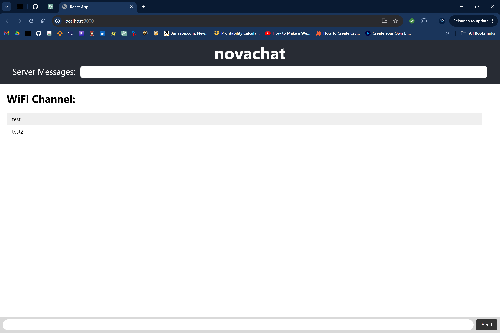

## TODO
- fix horizontal scrolling to be exact
- left panel that shows all available rooms/channels to jump to
- finish migration from index.html to app.js. migrate dependencies to react project
- left/right arrow options instead of j/k. visible arrow buttons on side of screen
- frontend branch

## Frontend Contributing Instructions
- 'npm i'?
- 'npm start' inside of ./novachat/
- Edit the JSX code inside the return block of App.js.
- Frontend TODO
  - Fix horizontal scrolling

## Backend Contributing Instructions
- 'npm run build && node server.js' inside of ./novachat/
